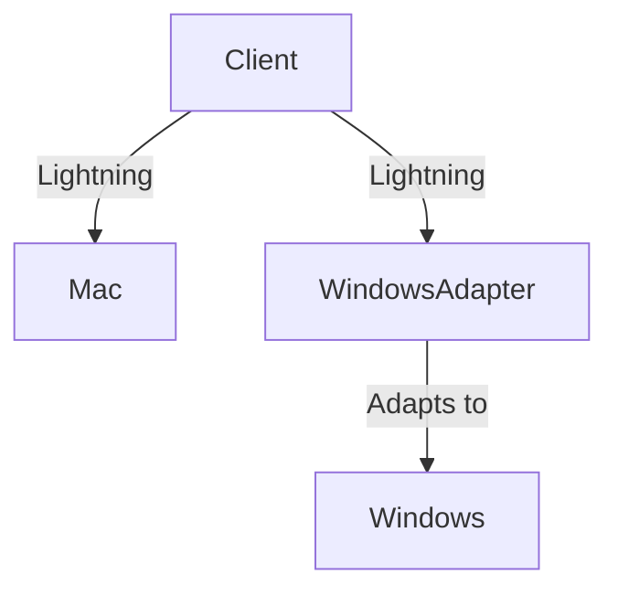

# LLD Systems

This repository contains implementations of various Low-Level Design (LLD) patterns and systems in Go (Golang) and Python. Each folder demonstrates a different design pattern or system, with clear, idiomatic code and runnable examples.

---

## Example: Adapter Pattern Diagram

Below is a simple diagram illustrating the Adapter pattern implemented in the `adapter/` folder:



---

## Contents

- **adapter/**: Demonstrates the Adapter design pattern, allowing incompatible interfaces to work together in Go.
- **bridge/**: Shows the Bridge design pattern, decoupling abstraction from implementation for flexible code in Go.
- **singleton/**: Implements the Singleton pattern in Go, ensuring a class has only one instance and provides a global point of access.

## How to Run Go Examples

Each Go pattern (e.g., `adapter`, `bridge`, `singleton`) is a self-contained module. To run an example:

1. Navigate to the pattern's directory:

   ```sh
   cd lld-systems/adapter
   ```

2. Run the main file:

   ```sh
   go run .
   ```

> Ensure you have Go installed. Download from [golang.org](https://golang.org/dl/).

## Folder Structure

- Each pattern folder contains:
  - `main.go`: Entry point demonstrating the pattern.
  - Supporting files: Interfaces, structs, and adapters as needed.

## Contributing

Contributions are welcome! Please open issues or submit pull requests for improvements or new patterns.

## License

This project is licensed under the MIT License.
