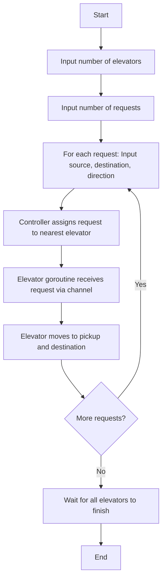

# Concurrent Elevator System

This project is a simulation of a concurrent elevator system written in Go. It demonstrates how to use goroutines and channels to manage multiple elevators processing requests in parallel, coordinated by an ElevatorController.

## Features
- Multiple elevators, each running as a goroutine
- Requests are assigned to the nearest elevator (greedy scheduling)
- Communication between controller and elevators via Go channels
- Thread-safe and scalable design

## How It Works
1. The user specifies the number of elevators and requests.
2. Each elevator runs in its own goroutine, listening for requests on its channel.
3. The ElevatorController assigns each request to the nearest elevator based on current floor.
4. Each elevator processes its requests independently and concurrently.

## File Structure
- `elevator.go`: Elevator struct, request struct, and main logic
- `elevatorController.go`: ElevatorController struct and scheduling/dispatch logic

## Flow Diagram



## How to Run
1. Make sure you have Go installed.
2. Navigate to the `concurrent-elevator-system` directory.
3. Run the program:
   ```sh
   go run elevator.go elevatorController.go
   ```
4. Follow the prompts to enter the number of elevators and requests.

## Example Usage
```
Enter number of elevators: 2
Enter number of requests: 3
Request 1 - Enter source floor: 0
Request 1 - Enter destination floor: 5
Request 1 - Enter direction (up/down): up
Request 2 - Enter source floor: 3
Request 2 - Enter destination floor: 1
Request 2 - Enter direction (up/down): down
Request 3 - Enter source floor: 2
Request 3 - Enter destination floor: 7
Request 3 - Enter direction (up/down): up
```

## Customization
- You can modify the scheduling logic in `ElevatorController` for different strategies (e.g., round-robin, load balancing).
- Extend the elevator or controller logic for more advanced features (e.g., request queueing, priority handling).

## License
This project is for educational purposes.
