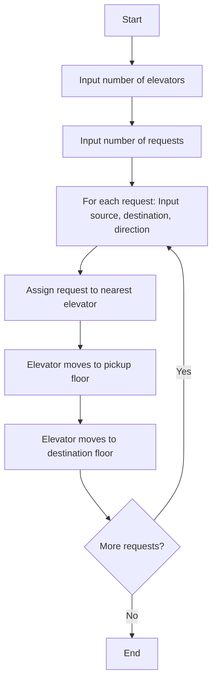

# Elevator System

This is a simple simulation of an elevator system written in Go. It supports multiple elevators and processes multiple requests, assigning each request to the nearest available elevator.

## Features
- Multiple elevators
- Multiple requests
- Each request specifies a source floor, destination floor, and direction (up/down)
- Requests are assigned to the nearest elevator
- Each elevator moves to the pickup floor and then to the destination floor

## File Structure
- `elevator.go`: Main logic for elevator movement and request processing
- `elevatorController.go`: (Optional) Contains an ElevatorController for managing elevators
- `request.go`: Defines the `Request` struct

## How to Run
1. Make sure you have Go installed.
2. Navigate to the `lld-systems/systems/elevator-system/` directory.
3. Run the program:
   ```sh
   go run elevator.go request.go
   ```
4. Follow the prompts to enter the number of elevators and requests.

## Example Usage
```
Enter number of elevators: 2
Enter number of requests: 3
Request 1 - Enter source floor: 0
Request 1 - Enter destination floor: 5
Request 1 - Enter direction (up/down): up
Request 2 - Enter source floor: 3
Request 2 - Enter destination floor: 1
Request 2 - Enter direction (up/down): down
Request 3 - Enter source floor: 2
Request 3 - Enter destination floor: 7
Request 3 - Enter direction (up/down): up
```

## Flow Diagram



## License
This project is for educational purposes.
